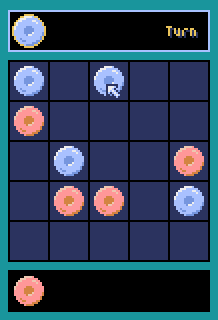

# フリック三目並べ

フリックして（弾いて）三目並べます。

## 操作方法

* マウスを使って操作します。
* 「Human vs Com」を選択するとコンピュータと対戦できます。
  * 「Level 3」が一番強いです。
* 「Click to Start」でゲーム開始です。
* クリックしてコマを取り、もう一度クリックして置きます。
  * 2～3秒クリックし続けると、デバッグモードとなり、色で勝敗が分かるようになります。

## 遊び方

* 最初の３手のコマは、ランダムに置いた状態から開始です。
* 自分の番になったら、手持ちのコマがあればそれを、なければ場のコマを取ります。
* 取ったコマは一番外側のマス（辺か角）に置きます。 
* 置くと内側に弾かれて、その列のコマは連鎖して移動し、枠外出たコマは最初のマスに置かれます。
* 自分のコマを三目並べると勝ちです。
  * 自分の番でも、相手のコマを三目並べてしまうと負けになります。
  * 自分と相手のコマが同時に三目並ぶと、引き分けになります。

